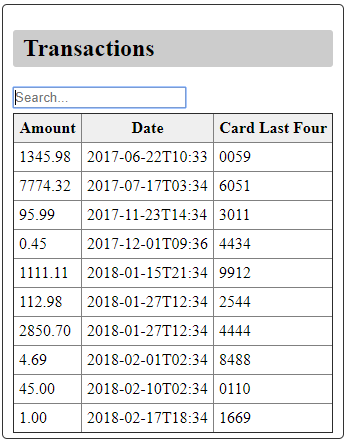

#Fuzzy Search Test

This is a simple implementation of a fuzzy search using React.
I did this for fun and to improve my skills and knowledge as a software developer. 

It's a list of transactions and a search field.
Each transaction consists of three fields: Amount, Date, and Card Last Four.
When you type something in the search field, the transactions are filtered in real time as you type.
The filter checks each of the three fields for a match and displays it if it matches
any of the three.

